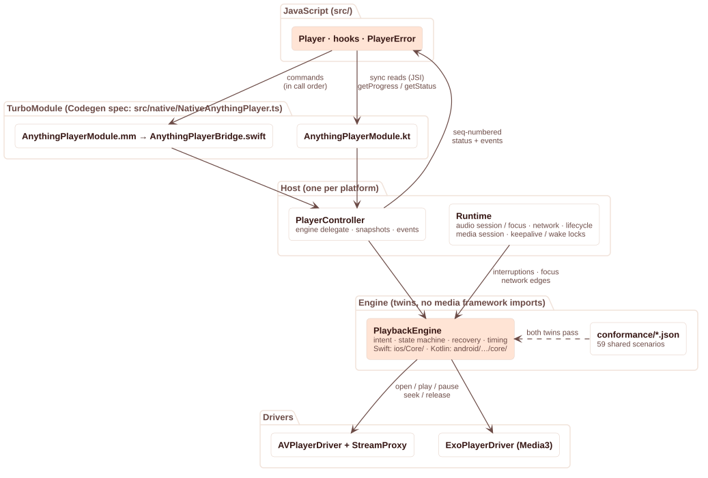

# Architecture

## Principle: native is the source of truth

React Native freezes JS timers in the background, can suspend or reload the JS runtime, and delivers native events asynchronously to a thread that may be busy. A player whose logic lives in JS (as the Rádio Animu app's did, out of necessity — it could only patch `expo-audio`) needs workarounds for every one of those: timers pumped by native frames, keepalives gated on JS state, stale-frame filters. Airwave moves the whole player into native code. JS is a client: it sends commands and mirrors snapshots.

### The engine

`PlaybackEngine` owns the play intent (`playWhenReady`), the state machine, interruptions, network edges and every recovery timer. It never touches a media framework: it drives an `EngineDriver` (open / play / pause / seek / release / sample) and reads time from an `EngineClock`. It never owns timers either — after every input it asks its host for one wake-up instant. That makes it deterministic and testable with a fake clock: the [conformance suite](../conformance/README.md) runs 59 scenarios (races, stalls, offline, handoffs, interruptions, focus, drift, re-entrancy …) against both implementations.

**Why two implementations instead of a shared core (Rust, C++, Kotlin Multiplatform)?** The engine is ~700 lines of decision logic, not CPU-bound, and the hard part is platform semantics around it. A shared core would cost: a cross-compilation toolchain for contributors; prebuilt binaries per Android ABI and iOS slice in the npm package (or a toolchain for every consumer); JNA (≈1.5 MB, for UniFFI's Kotlin bindings) or hand-written JNI; Swift ↔ C/C++ glue; and debugging across an FFI boundary. ICY de-framing, the one byte-level piece, is already done by Media3 on Android; the iOS proxy's de-interleaver and re-framer are ~130 lines, fuzz-tested against arbitrary chunking and splicing. Duplication is instead controlled by one executable specification both twins must pass.

### Stale-event protection

Every source open — `load`, a reconnect, a live-edge re-open — increments a *generation*. Drivers tag every observation with the generation of the item that produced it (iOS: captured by per-item observers and checked against the current item; Android: encoded in the media item id). The engine drops anything else. On top, the bridge stamps every event with a per-player sequence number, and JS never applies an older snapshot.

### Re-entrancy

ExoPlayer can call listeners synchronously from inside a command (`setPlayWhenReady` → `onIsPlayingChanged`). Found on device: the engine received "audio flowing" in the middle of `play()` and then overwrote it. Engines now update their own state *before* calling the driver, and the Android driver posts observations to the next main-loop turn. A conformance scenario with a re-entrant fake driver guards it.

## Platform layers

### iOS

- **AVPlayer**, one per player. `automaticallyWaitsToMinimizeStalling` off for live sources (start as soon as there is audio). The play intent is latched and applied on `readyToPlay` — `playImmediately` before readiness is silently ignored.
- **StreamProxy**: progressive HTTP(S) sources are played through an in-process loopback HTTP proxy (`NWListener` on `127.0.0.1`), with the upstream fetched by our `URLSession`. Reproduced in testing: after a server outage, AVFoundation's internal retry for an already-replaced item connected later and kept downloading the stream in the background with no item consuming it (an unbounded bandwidth leak and a phantom listener). With the proxy, retiring an item's token closes its upstream at once and late requests get `410`. The proxy also: coalesces the identical parallel requests AVFoundation sometimes issues for one item (measured on iOS 27: two readers for the item's lifetime, ~15 % of opens) onto one upstream; splices a fresh upstream into the same response when a productive live connection is dropped (ICY re-framed at the original cadence); applies backpressure (512 KB). HLS bypasses it. An `AVAssetResourceLoader` was tried first and rejected: AVFoundation treats loader-backed resources as files, and an endless stream stalled permanently after a few MB.
- **AudioSessionCoordinator**: `.playback` / `.longFormAudio`; interruptions (ignores late `.appWasSuspended` begins; resumes only with `.shouldResume` and no other app primary); route loss pauses anything that wants playback; media-services reset rebuilds players.
- **NowPlayingController**: `MPNowPlayingInfoCenter` + `MPRemoteCommandCenter`, published on change only (the system extrapolates position).
- **BackgroundKeepalive**: `AVAudioEngine` dither while a backgrounded player wants audio it cannot get.

### Android

- **ExoPlayer**, one per player, on the main looper, audio focus *not* handled by ExoPlayer (one app-wide coordinator), becoming-noisy handled, `WAKE_MODE_NETWORK`, 1 s start buffer, constant-bitrate seeking, a load-error policy that does not retry 4xx.
- **HTTP through OkHttp** (Media3's OkHttp data source; OkHttp already ships with React Native). Reproduced in testing: with the default `HttpURLConnection` source, a replaced silent socket stayed open until the 10 s read timeout, because a blocked read cannot be interrupted. Every HTTP call is tracked per playlist item and cancelled on re-open, connection release, unload and removal; `Call.cancel()` closes the socket at once. No idle connections are pooled.
- **Live continuations**: when a live item's connection ends while audio is still buffered, a fresh connection is queued in ExoPlayer's playlist and plays gaplessly.
- **SessionPlayer + AirwavePlaybackService**: the Media3 session's player is a `SimpleBasePlayer` facade over the engine, not ExoPlayer. Media3 keeps the service in the foreground only while the session reports play intent and BUFFERING/READY; ExoPlayer is idle between reconnect attempts, so exposing it directly would drop the foreground service mid-recovery and let the OS freeze the process. Every remote command goes through the engine.
- **AudioFocusCoordinator**: `AUDIOFOCUS_GAIN` (never `GAIN_TRANSIENT`: it makes other apps auto-resume when we abandon focus), delayed focus accepted, never plays without focus, background-start retry for Android 15+.
- **NetworkMonitor**: default-network callback; online = internet + validated (captive portals are offline); a validated switch of the default network is a handoff.

## Binding choice: TurboModule

Evaluated: **Turbo Native Module + Codegen**, **Expo Modules API**, **Nitro Modules**.

| | TurboModule | Expo Modules | Nitro |
|---|---|---|---|
| Runtime dependency for bare RN apps | none | `expo` (expo-modules-core) | `react-native-nitro-modules` |
| Works in Expo dev builds | yes (autolinking + config plugin) | yes | yes |
| Swift / Kotlin | Kotlin native; Swift behind a ~150-line ObjC++ shim | native | native (C++ interop underneath) |
| Typed contract | Codegen from TS spec | Swift/Kotlin DSL | Nitrogen from TS |
| Event emitters | typed `EventEmitter<T>` (RN ≥ 0.76) | yes | callbacks |
| Sync calls | yes (JSI) | yes | yes |

The deciding factors were installability and scope: Airwave makes a handful of calls per second, so call overhead is irrelevant (a synchronous `getProgress()` over JSI measured 5–20 µs p50 on the simulator / emulator, see [testing](testing.md)), while a mandatory `expo-modules-core` or Nitro dependency would be forced on every bare app. The ObjC++ shim is mechanical; all logic is Swift.

## Research notes (October 2026)

- **RNTP 5** (now commercial, `@rntp/player` 5.12): TurboModule with Swift + an ObjC++ bridge, Media3 `MediaSessionService` with a `ForwardingPlayer`, generation counters on AVPlayer item observers, `AVPlayerItemMetadataOutput` for repeated ICY updates, an ICY de-interleaver in its caching proxy, live-edge "refresh" by replacing the media item. It leaves recovery to the app (`retry()`), has no stall watchdog, and its iOS interruption handling resumes whatever was "playing" without checking `secondaryAudioShouldBeSilencedHint` or `.appWasSuspended`. Airwave's code is independent; nothing was copied.
- **expo-audio 58**: still pauses only *audible* players on interruptions and route loss (a buffering stream keeps its intent and starts over the call), reports no interruption reason, treats mute as volume 0 (losing the volume), and emits status frames on a timer across the bridge. Its Android focus handling now supports `AUDIOFOCUS_GAIN` and delayed focus.
- **Media3 1.11.1**: `MediaSessionService` promotes the service only while the session player has `playWhenReady` and BUFFERING/READY; the paused foreground timeout is at most 10 min; `IcyInfo.rawMetadata` exposes the raw block; `DefaultLoadErrorHandlingPolicy` retries every HTTP status.
- **Android 15+**: audio focus requests from background apps without a foreground service are denied.
- **iOS 27**: apps must adopt the scene lifecycle (the RN template's window-based `AppDelegate` traps at launch; the example uses a `SceneDelegate`).
