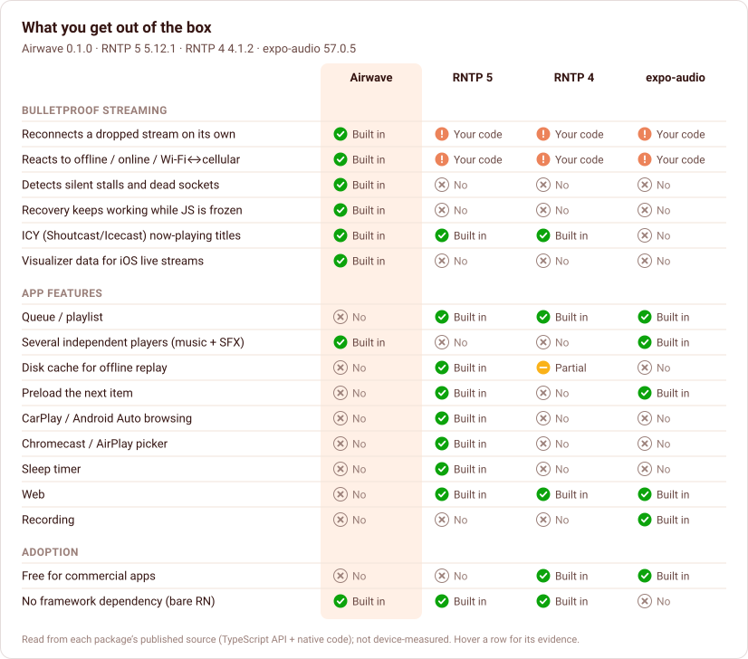
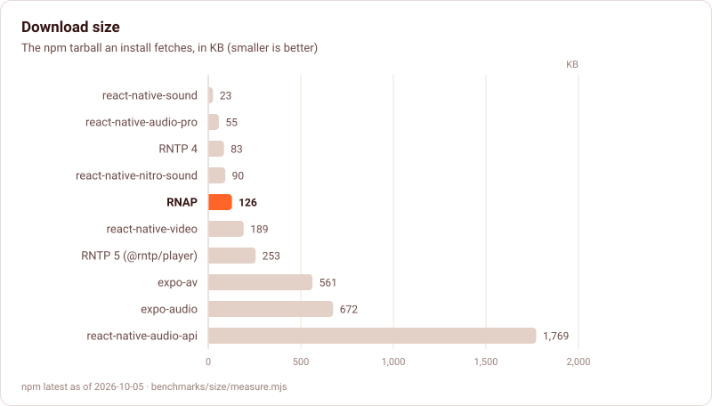
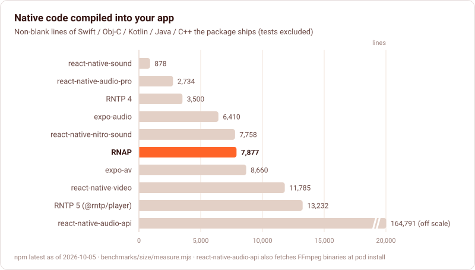
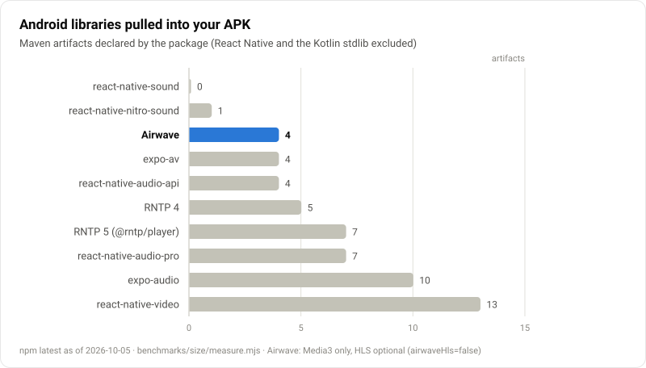
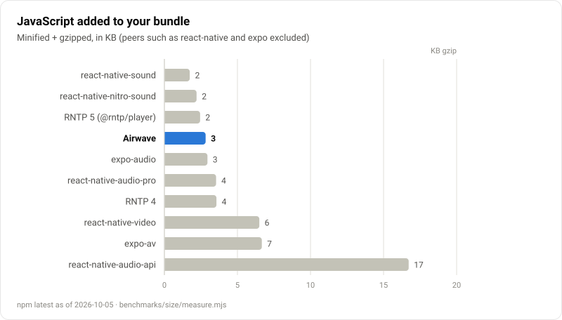

# Comparison & benchmarks

How RNAP compares with the other React Native audio libraries, from what each one actually ships. Every number here comes from a script in [`benchmarks/`](../benchmarks/README.md), so you can re-run it.

> **What this page is not.** The numbers are measured from the published npm packages, not on a phone. Runtime benchmarks across libraries (time to first audio, time to recover from a network drop, memory, bridge traffic) need a device lab. Their protocol is in [`benchmarks/README.md`](../benchmarks/README.md#on-device-benchmarks-protocol) and they are not published yet. RNAP's own device measurements are in [Testing](testing.md#results-this-release).

## What you get out of the box

RNAP is the only one of the four that recovers a stream without app code. The others give the app a `retry()` or a fresh `load()` and leave detection, backoff, connectivity and JS-frozen timing to you. That is the gap behind the most common complaint about RNTP: [a Wi-Fi ↔ 4G switch stops the stream for good](https://github.com/doublesymmetry/react-native-track-player/issues/686), and [iOS does not even report the error](https://github.com/doublesymmetry/react-native-track-player/issues/1437).

Where RNAP is behind today: queues, caching and preloading, CarPlay / Android Auto browsing, Cast, web, and a licence that is free for commercial apps. See the [roadmap](roadmap.md).

## Install size

| Package | Version | Licence | Download | Unpacked | JS (min+gz) | Native code | Android artifacts | Required extras |
|---|---|---|--:|--:|--:|--:|--:|---|
| **RNAP** | 0.1.0 | PolyForm NC | 124 KB | 442 KB | 2.8 KB | 7,802 lines | 4 | — |
| RNTP 5 (@rntp/player) | 5.12.1 | commercial | 253 KB | 1,211 KB | 2.4 KB | 13,232 lines | 7 | — |
| RNTP 4 | 4.1.2 | Apache-2.0 | 83 KB | 378 KB | 3.5 KB | 3,500 lines | 5 | — |
| expo-audio | 57.0.5 | MIT | 672 KB | 1,299 KB | 2.9 KB | 6,410 lines | 10 | `expo`, `expo-asset` |
| expo-av | 16.0.8 | MIT | 561 KB | 1,268 KB | 6.6 KB | 8,660 lines | 4 | `expo` |
| react-native-audio-pro | 10.1.2 | MIT | 55 KB | 268 KB | 3.5 KB | 2,734 lines | 7 | `zustand` |
| react-native-nitro-sound | 0.2.20 | MIT | 90 KB | 508 KB | 2.2 KB | 7,758 lines | 1 | `react-native-nitro-modules`, `@react-native-community/slider` |
| react-native-video | 6.19.3 | MIT | 189 KB | 937 KB | 6.5 KB | 11,785 lines | 13 | — |
| react-native-audio-api | 0.13.6 | MIT | 1769 KB | 9,243 KB | 16.7 KB | 164,791 lines | 4 | `semver` |
| react-native-sound | 0.13.0 | MIT | 23 KB | 92 KB | 1.7 KB | 878 lines | 0 | — |

Measured 2026-10-05 against the latest npm releases (`benchmarks/results/size.json`).

How to read it:

- **JavaScript is not where the cost is.** Every player adds 2–7 KB of gzipped JS, because they all do their work in native code. The meaningful costs are the native code and the Android libraries your app compiles.
- **RNAP's native code** is 7.8k lines for the engine twins, the iOS stream proxy, the iOS stream visualizer and the media sessions. RNTP 5 is 13.2k. The minimal players (react-native-sound, audio-pro, RNTP 4) are smaller because they do much less: no recovery, no proxy, no visualizer.
- **Android libraries**: RNAP pulls in Media3 only (ExoPlayer, session, the OkHttp data source and HLS). HLS can be left out with `rnapHls=false`. expo-audio adds DASH, SmoothStreaming and Media3 UI; react-native-video adds IMA ads and RTSP as well.
- **No extras.** RNAP needs nothing beyond React Native: no framework (`expo` is optional, for the config plugin only), no Nitro, no worklets, no state library.
- **Download size** is mostly source and prebuilt JS for every package. RNAP ships its TypeScript source and the compiled output (124 KB).

## Methodology

- `node benchmarks/size/measure.mjs` installs every package from npm, packs this repository as it would be published, and records the tarball and unpacked sizes. It also counts the non-blank native source lines that compile into an app (tests, examples and builds excluded), parses the Maven artifacts from `android/build.gradle`, and bundles each package's JS with esbuild (minified, gzip -9, with React Native, React, Expo and other peer frameworks excluded).
- `node benchmarks/charts/render.mjs` draws the charts on this page from the results.
- The capability matrix (`benchmarks/results/capabilities.json`) was read from each package's TypeScript API and native sources. Each row records its evidence; hover a row in the chart to see it.
