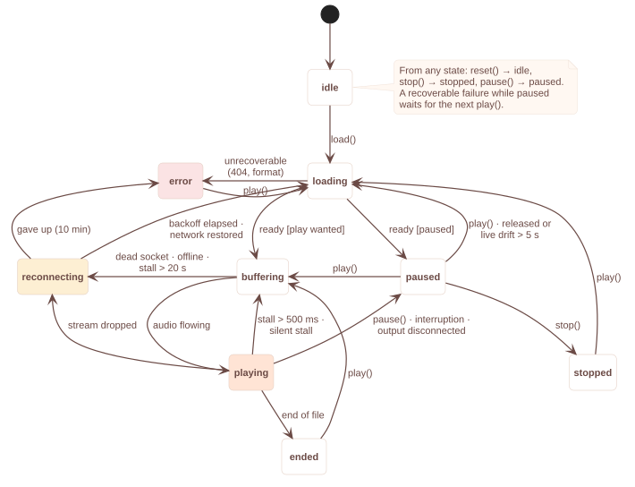

# Playback

## Sources

`load()` accepts a URI string, a `Source` object, or an asset module:

```ts
await player.load('https://example.com/a.mp3');
await player.load(require('./assets/jingle.mp3'));
await player.load({
  uri: 'https://radio.example.com/stream',
  headers: { Authorization: 'Bearer …', 'User-Agent': 'MyApp/1.0' },
  live: true, // optional hint, see below
  metadata: { title: 'My Radio', artist: 'Live', artwork: 'https://…/logo.png' },
});
```

| URI | iOS | Android |
|---|---|---|
| `https://…`, `http://…` | ✓ (cleartext needs an ATS exception) | ✓ (cleartext needs a network-security config) |
| `file:///…` and absolute paths | ✓ | ✓ |
| `content://…` | – | ✓ |
| `require('./a.mp3')` | ✓ debug (Metro) and release (bundle) | ✓ debug (Metro) and release (raw resource) |
| HLS (`.m3u8`) | ✓ | ✓ (disable with `rnapHls=false` in `gradle.properties` to save ~300 KB) |

Formats are whatever the platform decodes: MP3, AAC/AAC+ (ADTS), M4A/MP4, WAV, FLAC (Android; iOS 11+), Opus/Vorbis (Android).

`live: true` is optional — an indefinite duration is detected as live — but it lets live behaviour (fast start, live-edge recovery) apply from the first byte.

`headers` are sent with every request for the source (including reconnects). On iOS they go through the app's own `URLSession`; on Android through Media3's HTTP stack.

## Commands

All commands are applied by native code **in call order** and resolve with the status *after* they were applied. They reject with a [`PlayerError`](errors.md).

| Command | Behaviour |
|---|---|
| `load(source, { autoplay?, startPosition? })` | Opens a source. Resolves when it is ready to play, or when a later `load` replaced it; rejects if it cannot be opened. Keeps the current intent unless `autoplay` is given: a playing player switches sources seamlessly (station switching), a paused one stays paused. |
| `play()` | Starts or resumes. A live stream that was paused for longer than the drift budget (default 5 s) or whose connection was released re-opens at the live edge. A finished file restarts. Rejects with `AUDIO_FOCUS_DENIED` when another app or a call holds audio focus. |
| `pause()` | Pauses. A paused **live** stream releases its network connection after 30 s. |
| `toggle()` | `pause()` if playback is wanted, `play()` otherwise. |
| `stop()` | Pauses and releases network and decoder resources; the source stays loaded and `play()` re-opens it (files restart from the beginning). |
| `reset()` | Unloads the source (`idle`). |
| `seekTo(seconds)` | Seconds, clamped to the duration. Rejects `NOT_SEEKABLE` for live streams. |
| `setVolume(0…1)` | Per-player volume, independent of `setMuted`. |
| `setMuted(bool)` | Mute without losing the volume. |
| `setRate(rate)` | Playback rate (files; live streams will run out of buffer above 1). |
| `release()` | Stops and frees every native resource. Commands afterwards reject `PLAYER_RELEASED`. |

Rapid sequences are safe: `play(); pause(); play(); pause();` ends paused; `load(A); load(B); load(C);` plays C, and A/B resolve as superseded. Events from A or B that arrive late are dropped natively (each open has a *generation*).

## State model



| `state` | Meaning |
|---|---|
| `idle` | nothing loaded |
| `loading` | a source is being opened (also during a reconnect attempt) |
| `buffering` | playback wanted, audio not flowing (start, stall) |
| `playing` | audio is flowing |
| `paused` | loaded and not playing — by the app/user, or the system (`status.interruption` says which) |
| `stopped` | resources released, source kept |
| `reconnecting` | the connection was lost while playback is wanted; `status.reconnect` has the attempt and next time |
| `ended` | a file played to its end |
| `error` | unrecoverable failure (`status.error`) |

`status.playWhenReady` is the play *intent*: it is `true` while loading, buffering and reconnecting. Stalls shorter than 500 ms are not published (no spinner flicker).

## Progress

```ts
const { position, duration, buffered, bufferedAhead, liveOffset } = player.getProgress();
```

`getProgress()` is a synchronous JSI call that reads a snapshot native code keeps and extrapolates it to "now", so it is cheap enough to call every frame and correct right after JavaScript was frozen in the background. `useProgress(player, intervalMs)` polls it while the app is in the foreground, so a progress bar needs no events.

To follow the audio where JS timers are frozen (an Android app in the background), set `progressInterval`: the player then emits `progress` events from a native timer while playing ([events](events.md)).

```ts
const player = new Player({ progressInterval: 1000 });
player.on('progress', ({ position, liveOffset }) => { /* e.g. switch the lock screen to the next song */ });
```

For live streams `position` is the time played since the stream was (re-)opened, `duration` is `null`, `bufferedAhead` is how much audio is buffered past the playhead, and `liveOffset` is how far behind the live edge playback is, when it can be measured: HLS program dates (`EXT-X-PROGRAM-DATE-TIME`), ExoPlayer's live window, and on iOS any live HTTP stream, from the audio the stream proxy has handed the player. Otherwise it is `null`; use `bufferedAhead`.

## Several players

Players are independent native engines. The lock screen shows the most recently started player with `mediaSession.enabled` (the default). Audio focus is per app on Android: all players share it, and a focus loss pauses every player that does not use `audio.mixWithOthers`.

## Local files

```ts
import { Paths } from 'expo-file-system'; // or react-native-fs, etc.
await player.load(`${Paths.document.uri}episodes/42.mp3`);
```

Local files are never "released" while paused and never reconnect; seeking is exact.
